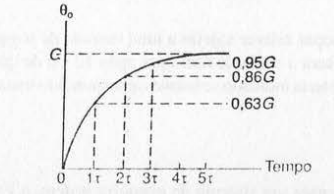

Data: 17/08/2021
Disciplina: Controle 1
Semana: Resumo

## Sumário

- [Funções de Transferência de Elementos Dinâmicos](#funções-de-transferência-de-elementos-dinâmicos)
- [Elementos de Primeira e Segunda Ordens](#elementos-de-primeira-e-segunda-ordens)
- [Sistemas de Primeira Ordem](#sistemas-de-primeira-ordem)
  * [Entrada Degrau para Sistema de Primeira Ordem](#entrada-degrau-para-sistema-de-primeira-ordem)
  * [Entrada Rampa para Sistema de Primeira Ordem](#entrada-rampa-para-sistema-de-primeira-ordem)
  * [Entrada Impulso para um Sistema de Primeira Ordem](#entrada-impulso-para-um-sistema-de-primeira-ordem)
- [Sistemas de Segunda Ordem](#sistemas-de-segunda-ordem)
  * [Entrada Degrau para Sistema de Segunda Ordem](#entrada-degrau-para-sistema-de-segunda-ordem)
- [Medidas de Desempenho Para Sistemas de Segunda Ordem](#medidas-de-desempenho-para-sistemas-de-segunda-ordem)
- [Classificação dos Sistemas](#classificação-dos-sistemas)
- [Erro em Regime Permanente](#erro-em-regime-permanente)
  * [Classificação dos Sistemas](#classificação-dos-sistemas-1)
  * [Erro em Regime Permanente para uma Entrada Degrau](#erro-em-regime-permanente-para-uma-entrada-degrau)
  * [Erro em Regime Permanente para uma Entrada Rampa](#erro-em-regime-permanente-para-uma-entrada-rampa)
  * [Erro em Regime Permanente para uma Entrada Parabólica](#erro-em-regime-permanente-para-uma-entrada-parabólica)
  * [Erro em Regime Permanente para Entradas Diferentes](#erro-em-regime-permanente-para-entradas-diferentes)
- [Pólos e Zeros](#pólos-e-zeros)
  * [Diagrama de Pólos e Zeros](#diagrama-de-pólos-e-zeros)
- [Estabilidade](#estabilidade)
  * [Saídas para diferentes Pólos a uma Entrada Impulso](#saídas-para-diferentes-pólos-a-uma-entrada-impulso)
  * [Saídas para diferentes Pólos a uma Entrada Degrau](#saídas-para-diferentes-pólos-a-uma-entrada-degrau)
- [Controle Proporcional](#controle-proporcional)
- [Controle Integral](#controle-integral)
- [Controle Proporcional + Integral](#controle-proporcional+integral)
- [Controle Derivativo](#controle-derivativo)
- [Controle Proporcional + Derivativo](#Controle-Proporcional-Derivativo)
- [Controle PID](#controle-pid)
- [Ajustes de Ganho de Controlador](#ajustes-de-ganho-de-controlador)
  * [Método da Curva de Reação do Processo](#método-da-curva-de-reação-do-processo)
  * [Método do Ciclo Máximo](#método-do-ciclo-máximo)
- [Realimentação de Velocidade](#realimentação-de-velocidade)
- [Parâmetros](#parâmetros)

## Funções de Transferência de Elementos Dinâmicos

- A **função de transferência**  %24) de um sistema linear que descreve o comportamento dinâmico é definia como a fração da transformada de Laplace da variável de saída %24) pela transformada de Laplace da variável de entrada %24):

%3D%5Cfrac%7B%5Ctheta_0%7D%7B%5Ctheta_i%7D%3D%5Cfrac%7Bb_1%7D%7Ba_2s%2Ba_1s%2Ba_0%7D%24)

[Voltar ao Topo](#Sumário)

## Elementos de Primeira e Segunda Ordens

- **Ordem do sistema**: A mais alta potência da derivada na equação diferencial ou a mais alta potência de s no denominador
- **Forma Geral Sistema de Primeira Ordem no domínio s**:

- **Forma Geral Sistema de Segunda Ordem no domínio s**:

%3D%5Cfrac%7B%5Ctheta_o(s)%7D%7B%5Ctheta_i(s)%7D%3D%5Cfrac%7Bb_0%7D%7Ba_2s%5E2%2Ba_1s%2Ba_0%7D%3D%5Cfrac%7B(b_0%2Fa_0)%7D%7B(a_2%2Fa_0)s%5E2%2B(a_1%2Fa_0)s%2B1%7D%3D%5Cfrac%7Bb_0%5Comega_n%5E2%7D%7Bs%5E2%2B2%5Czeta%5Comega_ns%2B%5Comega_n%5E2%7D%24)

## Sistemas de Primeira Ordem

%3D%5Cfrac%7B%5Ctheta_o(s)%7D%7B%5Ctheta_i(s)%7D%3D%5Cfrac%20%7Bb_0%7D%7Ba_1s%2Ba_0%7D%3D%5Cfrac%7Bb_0%2Fa_0%7D%7B(a_1%2Fa_0)%2B1%7D%3D%5Cfrac%7BG%7D%7B%5Ctau%20s%2B1%7D%24)

### Entrada Degrau para Sistema de Primeira Ordem

- **Reposta**: %7D%5D%24)

### Entrada Rampa para Sistema de Primeira Ordem

- **Reposta**: %5D%24)

### Entrada Impulso para um Sistema de Primeira Ordem

- **Resposta:** e%5E%7B-t%2F%5Ctau%7D%24)

## Sistemas de Segunda Ordem

%3D%5Cfrac%7B%5Ctheta_o(s)%7D%7B%5Ctheta_i(s)%7D%3D%5Cfrac%7Bb_0%7D%7Ba_2s%5E2%2Ba_1s%2Ba_0%7D%3D%5Cfrac%7B(b_0%2Fa_0)%7D%7B(a_2%2Fa_0)s%5E2%2B(a_1%2Fa_0)s%2B1%7D%3D%5Cfrac%7Bb_0%5Comega_n%5E2%7D%7Bs%5E2%2B2%5Czeta%5Comega_ns%2B%5Comega_n%5E2%7D%24)

### Entrada Degrau para Sistema de Segunda Ordem

Característica da resposta de sistemas de 2ª ordem:

**Amortecimento** 

$ζ > 1$ 

$ζ = 1$

$0 < ζ < 1$ 

$ζ = 0$

**Classificação** 

Super amortecida 

Criticamente Amortecida 

Sub amortecida 

Não Amortecida

**Raízes**

2, Reais

1, Reais iguais

2, Complexas

2, Complexas Puras

 **Resposta**

$\theta_o=b_0[1-\sin\omega_nt]$

 $\theta_o=b_0[1-\frac1{\sqrt{(1-\zeta^2)}}e^{-(\zeta\omega_n)t}\sin(\omega_n\sqrt{1-\zeta^2}\space t+\phi)]$,$\cos \phi = \zeta$

 $\theta_o=b_0[1-e^{(-\omega_n)t}-\omega_nte^{(-\omega_n)t}]$

 $\theta_0=1+[\mp\frac{b_0\zeta}{2\sqrt{(\zeta^2-1)}}-\frac{b_0}{2}]e^{(-\zeta\omega_n\pm\omega_n\sqrt{(\zeta^2-1)})t}$

## Medidas de Desempenho Para Sistemas de Segunda Ordem

- **Tempo de pico**  $\omega t_P$ = $\pi$  : Tempo gasto para a resposta ir de 0 ao primeiro valor de pico. Tempo para a resposta oscilatória completar um meio ciclo, $\pi$
- **Sobre Sinal**: Quantidade máxima na qual a reposta ultrapassa o valor em regime permanente. Amplitude do primeiro pico.
- **Sobre Sinal Percentual**   $\exp(\frac {-\zeta \pi} {\sqrt{(1-\zeta^2)}})\times100 \%$   : Porcentagem do valor em regime permanente
- **Primeiro Sobre Sinal**:  $\theta_{ss}\exp(\frac {-\zeta \pi} {\sqrt{(1-\zeta^2)}})$
- **Segundo Sobre Sinal**:  $\theta_{ss}\exp(\frac {-2\zeta \pi} {\sqrt{(1-\zeta^2)}})$
- **Razão de Decaimento:  $\exp |\frac{-\zeta\pi}{\sqrt{(1-\zeta^2)}}|$  :** Indica a velocidade de decaimento, razão entre a amplitude do segundo sobre sinal e amplitude do primeiro sobre sinal
- **Tempo de Estabilização** $t_s$  : Tempo gasto para que as oscilações desapareçam, resposta diminuir e ficar dentro de um percentual
- **Tempo de Estabilização $t_s$ 2% do valor final:  $t_s$ = $4 / \zeta\omega_n$**
- **Tempo de Estabilização $t_s$ 5% do valor final:  $t_s$ = $3 / \zeta\omega_n$**
- **Período**: $2\pi$ / $\omega_n$
- **Número de Oscilações** = tempo de estabilização / período : $2/\pi$ $\sqrt{(\frac{1}{\zeta^2}-1)}$

## Classificação dos Sistemas

- O sistema em malha fechada é considerado tendo realimentação unitária
- Os sistemas são classificados com base na função de transferência do ramo direto com realimentação unitária, a **função de transferência de malha aberta** de um sistema em malha fechada
- A **função de transferência de malha aberta** de um sistema com função de transferência do ramo direto $G(s)$ e de realimentação $H(s)$ é calculada por:

$G_o(s)=\frac{G(s)}{1+G(s)[H(s)-1]}$

- A função de transferência de malha aberta de sistemas tem a **forma geral**:

$\frac{K(s^m+a_{m-1}s^{m-1}+a_{m-2}s^{m-2}+...+a_1s+a_0)}{s^q(s^n+b_{n-1}s^{n-1}+b_{n-2}s^{n-2}+...+b_1s+b_0)}$

- $q$ é o valor chamado **tipo** ou **classe do sistema.** Identifica o número de fatores $1/s$ na , ou número de integradores função de transferência de malha aberta

## Erro em Regime Permanente

- **Erro**: A diferença entre o sinal de saída de saída, a referência, e o sinal de saída real que ocorre no sistema:

$E(s)=\theta_i(s)-\theta_o(s)$

### Classificação dos Sistemas

- A **função de transferência de malha aberta** de um sistema com função de transferência do ramo direto $G(s)$ e de realimentação $H(s)$ é calculada por:

$G_o(s)=\frac{G(s)}{1+G(s)[H(s)-1]}$

- A função de transferência de malha aberta de sistemas tem a **forma geral**:

$\frac{K(s^m+a_{m-1}s^{m-1}+a_{m-2}s^{m-2}+...+a_1s+a_0)}{s^q(s^n+b_{n-1}s^{n-1}+b_{n-2}s^{n-2}+...+b_1s+b_0)}$

- $q$ é o valor chamado **tipo** ou **classe do sistema**
- Identifica o **número de integradores** ou termos independentes s no denominador ($1/s$) na **função de transferência de malha aberta**

### Erro em Regime Permanente para uma Entrada Degrau

- $K_P$ é chamado **constante de erro de posição**, sem unidades:

$K_P=\lim\limits_{s\to0}G_0(s)$

- O erro em regime permanente para um **sistema tipo 0** é:

$e_{ss}=\frac1{1+K_P}$

- Para sistemas de tipo maiores o **erro em regime permanente** é 0

### Erro em Regime Permanente para uma Entrada Rampa

- $K_V$ é chamado **constante de erro de erro de velocidade**, e tem unidade $s^{-1}$:

$K_V=\lim\limits_{s\to0}sG_0(s)$

- Para um entrada rampa com uma razão de variação com o tempo de uma constante $A$, o erro em regime permanente para o **sistema tipo 1** é:

 $e_{ss}=\frac A{K_V}$

- Para sistemas de tipo maiores o **erro em regime permanente** é 0
- Para sistemas de tipo 1 o **erro em regime permanente** é $\infin$

### Erro em Regime Permanente para uma Entrada Parabólica

- $K_A$ é chamado **constante de erro de erro de aceleração**, e tem unidade $s^{-2}$:

$K_A=\lim\limits_{s\to0}s^2G_0(s)$

- Se a entrada é parabólica da forma $\frac A{s^3}$, onde $A$ é uma constante, o erro em regime permanente para o **sistema tipo 2** é:

$e_{ss}=\frac A{K_A}$

- Para sistemas de tipo maiores o **erro em regime permanente** é 0
- Para sistemas de tipo menores o **erro em regime permanente** é $\infin$

### Erro em Regime Permanente para Entradas Diferentes

- Pelo principio da superposição, o erro em regime permanente é igual a soma dos erros de cada segmento do sinal de entrada

## Pólos e Zeros

- A função de transferência em malha fechada pode ser representada como:

$G(s)=\frac{K(s+z_1)(s+z_2)...(s+z_m)}{(s+p_1)(s+p_2)...(s+p_n)}$

- Os **zeros** são as raízes $-z_1$,$-z_2$,...,$-z_m$ do numerador e os valores de s para os quais a função de transferência é zero
- Os **pólos** são as raízes $-p_1$,$-p_2$,...,$-p_n$ do denominador e os valores de s para os quais a função de transferência é infinita

### Diagrama de Pólos e Zeros

- Forma de representar os pólos e zeros de uma função de transferência
- O eixo x é a parte real e o eixo y é a parte imaginária
- A posição de um **pólo** é marcada por um $X$
- A posição de um **zero** é marcada por um $O$
- O gráfico bidimensional é chamado plano $s$

## Estabilidade

- Um sistema é **estável** se para entradas finitas (limitadas) ele produz saídas limitadas (limite, saídas que tendem a algum valor)
- Um sistema é **instável** se para entradas finitas (limitadas) ele **não** produz saídas limitadas

**Por Análise de Pólos:**

- **Estabilidade**: Todos os pólos devem ter parte real negativa
- **Criticamente Estável**: Um ou mais pólos tem parte real zero e nenhuma pode ser positiva
- **Instabilidade**: Um ou mais pólos tem parte real positiva

### Saídas para diferentes Pólos a uma Entrada Impulso

### Saídas para diferentes Pólos a uma Entrada Degrau

## Controle Proporcional

- A saída do controlador é proporcional ao erro e a **constante de ganho proporcional, $K_P$.** Depende apenas da amplitude do erro no instante de tempo

$\text{Saída}=K_Pe$

- **Função de Transferência do Controlador**: $G_C(s)=K_P$
- O controlador é um amplificador com ganho constante
- Um ganho constante tende a existir somente para uma certa faixa de erros, chamada **banda proporcional**

- **Sistema com Controle Proporcional**:

- **Função de Transferência**: $G_o(s)=K_PG_P(s)$
- Altera os pólos da função
- **Desvantagem**: O controlador não introduz o termo $1/s$ no ramo direto → Se o sistema é do tipo 0, continua sendo do tipo 0 → Continua com erro em regime permanente

## Controle Integral

- A saída do controlador é proporcional à integral do sinal do erro e a **constante de ganho integral, $K_I$.** Tem unidade $s^{-1}$

$\text{Saída}=K_I\int\limits_0^1e \space dt$

- **Função de Transferência do Controlador**: $G_C(s)=\frac{K_I}{s}$
- A integral é a área da curva do sinal do erro e aumenta de maneira regular a medida que o erro aumenta
- A saída é proporcional ao acúmulo de efeitos de erros em momentos anteriores

- **Sistema com Controle Integral**:

- **Função de Transferência**: $G_o(s)=(\frac{K_I}{s})G_P(s)$
- **Vantagem**: O controlador introduz o termo $1/s$ no ramo direto → Aumenta o tipo do sistema em 1 → Se o sistema é do tipo 0, o erro em regime permanente desaparece para uma entrada degrau
- **Desvantagem**: Introdução de um pólo na origem, a assíntotas da raízes apontam mais em direção ao semi plano direito to plano s, ou seja, a **estabilidade** relativa fica **reduzida**

## Controle Proporcional + Integral

- A redução na estabilidade relativa resultante do controle integral pode ser resolvida pela ação de controle proporcional mais integral

- **Função de Transferência do Controlador**: %3D%5Cfrac%7BK_P%5Bs%2B(K_I%2FK_P)%5D%7D%7Bs%7D%24)
-  é a **constante de tempo integral**
- A saída do controlador quando existe um erro em degrau

**Sistema com Controle Integral + Proporcional:**

- **Função de Transferência**: %3D(%5Cfrac%7BK_P%5Bs%2B(1%2F%5Ctau_I)%5D%7D%7Bs%7D)G_P(s)%24)
- **Vantagem**: O fator  aumenta o tipo do sistema para 1 e  remove a possibilidade de um erro em regime permanente para uma entrada degrau
- **Desvantagem**: Redução da estabilidade relativa, mas não é tão grande no caso do controle integral sozinho

## Controle Derivativo

- A saída do controlador é proporcional à taxa de variação do sinal do erro e a **constante de ganho derivativo, $K_D$.** Tem unidade 

- **Função de Transferência do Controlador**: %3DK_Ds%24)
- O controle derivativo é insensível a sinais de erro constantes ou de variação lenta, é usado em combinação com outras formas de controle
- A saída é proporcional à taxa de variação do erro

- **Sistema com Controle Derivativo**:

- **Função de Transferência**: %3D%5Cfrac%7BK_DG_P(s)%7D%7B1%2BK_DsG_P(s)%7D%24)
- **Vantagem**: Usado com outras formas de controle, aumenta a velocidade de correção da resposta de um sistema ao erro
- **Desvantagem**: Cancela um termo  e reduz a ordem do sistema em 1

- Na prática, um controle derivativo é obtido usando um **compensador em avanço**. O controlador tem função de transferência: %2F(s%2Bp)%2C%20%5Ctext%7Bcom%20%7D%20p%3Ez%24)

## Controle Proporcional + Derivativo

- **Função de Transferência**: %3D(K_P%2BK_Ds)G_P(s)%3DK_D%5B(1%2F%5Ctau_D)%2Bs%5DG_P(s)%24)
-  é a **constante de tempo derivativo**
- Um zero é introduzido em 
- Sem mudanças no tipo do sistemas e no erro permanente
- **Sistema com Controle Proporcional + Derivativo:**

[Voltar ao Topo](#Sumário)

## Controle PID

- Um controlador proporcionai mais derivativo mais integrativo (PID), ou controlador de três termos, em um sistema da forma:

Tem saída: 

- **Função de Transferência do Controlador**: %3DK_P%2B%5Cfrac%7BK_I%7D%7Bs%7D%2BK_Ds%24)

Como a constante de tempo integral  é   e a constante de tempo derivatia , então:

- **Função de Transferência do Controlador**: %3DK_P(1%2B%5Cfrac%7B1%7D%7B%5Ctau_is%7D%2B%5Ctau_Ds%24)
- **Função de Transferência de Malha Aberta**: %3D%5Cfrac%7BK_P(%5Ctau_iS%2B1%2B%5Ctau_i%5Ctau_ds%5E2))G_P(s)%7D%7B%5Ctau_is%7D%24)

- O controlador PID aumenta em 2 o número de zeros e de 1 o número de pólos.
- O fator    aumenta o tipo de 1
- Na prática, é utilizado um compensador em avanço e não um controlador PID ideal

## Ajustes de Ganho de Controlador

- **Sintonização:** Processo de selecionar a melhor regulação para o controlador

### Método da Curva de Reação do Processo

- Abrir a malha de controle tal que nenhuma ação de controle ocorra
- Aplicar um sinal de entrada de teste e obter um valor de erro
- O sinal de teste deve ser o menor possível
- A curva do sinal medido é chamada **curva de reação do processo**

- O sinal de teste P é expresso como variação na porcentagem de correção
- A variável medida é expressa como a porcentagem da faixa de escala total
- A tangente exibe o gradiente máximo da curva
- O tempo que o sinal de teste começa e a tangente intercepta o eixo do tempo é chamado **tempo de atraso** L

### Método do Ciclo Máximo

- As ações derivativas e integrativas são reduzidas para seus valores mínimos
-  é ajustada para um valor baixo e então é gradualmente aumentada
- Pequenos são distúrbios são aplicados enquanto isso, até gerar oscilações
- O valor crítico da constante  é o observado e o período  das oscilações

## Realimentação de Velocidade

- Sistemas envolvendo o posicionamento de algum objeto, por exemplo, o braço de um robô, uma característica importante é o sistema responder rapidamente a erros e não produzir oscilações excessivas ou sobre-sinais
- Isso pode ser obtido inserindo um ramo de realimentação dentro do ramo de realimentação principal, a chama realimentação de velocidade
- A saída do ramo de realimentação está ligado é relacionada com a entrada por: 
- **Função de Transferência de Realimentação**: %3DK_Vs%24)
-  é uma constante, o ganho da realimentação
- **Realimentação de Posição** é usada para designar realimentação do valor da saída, os termos aparecem de denominações anteriores para sistemas de controle de posição de objetos

- A **realimentação de velocidade** introduz  um termo K_Vs%24) no denominador, e portanto, na equação característica. A estabilidade relativa aumenta, o amortecimento aumentou para a mesma frequência angular natural, e esta aumentou para o mesmo amortecimento
- O **sobre sinal percentual** é: %7D%5Ctimes100%5C%25%3D%5Cexp%7B(%5Cfrac%7B1%7D%7B%5Ctg%5Cphi%7D)%7D%5Ctimes100%5C%25%24)
- Incluir a realimentação de velocidade reduz  para um valor particular de frequência angular natural → Uma redução na  e no sobre sinal

## Parâmetros

[Voltar ao Topo](#Sumário)
